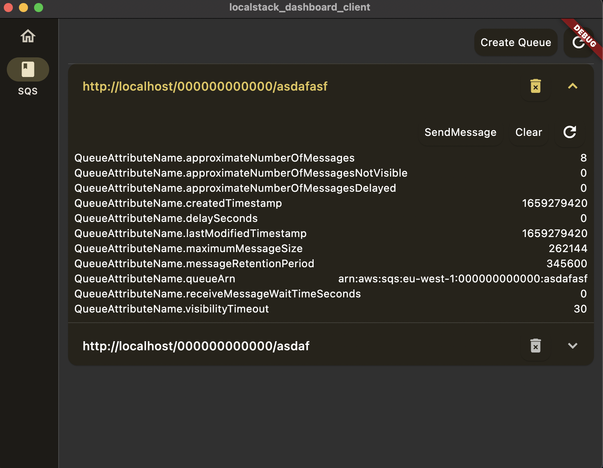

# localstack_dashboard_client

local stack dashboard implemented with flutter + riverpod.

The end goal is to support all features on [localstack](https://docs.localstack.cloud/aws/feature-coverage/).

Currently under development for SQS.


## Features

- [ ] Amplify
- [ ] API Gateway V2
- [ ] AppSync
- [ ] Athena
- [ ] Backup
- [ ] CloudFormation
- [ ] CloudFront
- [ ] CloudWatch
- [ ] CodeCommit
- [ ] Cognito
- [ ] Elastic Compute Cloud (EC2)
- [ ] Elastic Container Registry (ECR)
- [ ] Elastic Container Service (ECS)
- [ ] Elastic Kubernetes Service (EKS)
- [ ] Elastic Load Balancing
- [ ] Elastic MapReduce (EMR)
- [ ] ElastiCache
- [ ] Elasticsearch Service
- [ ] Glue
- [ ] Identity and Access Management (IAM)
- [ ] IoT
- [ ] Kinesis
- [ ] Kinesis Data Analytics
- [ ] Kinesis Data Firehose
- [ ] Lambda
- [ ] Managed Streaming for Kafka (MSK)
- [ ] Neptune
- [ ] OpenSearch Service
- [ ] Quantum Ledger Database (QLDB)
- [ ] Relational Database Service (RDS)
- [ ] Route53
- [ ] S3
- [ ] SageMaker
- [ ] Simple Email Service (SES)
- [ ] Simple Queue Service (SQS)
- [ ] Systems Manager (SSM)
- [ ] Timestream
- [ ] Transfer
- [ ] XRay Tracing

## Screen Example




## Error Case
- The request client is not a secure context and the resource is in more-private address space `local`.
    ```
    chrome: chrome://flags/#block-insecure-private-network-requests -> disabled
    edge: edge://flags/#block-insecure-private-network-requests -> disabled
    ```
