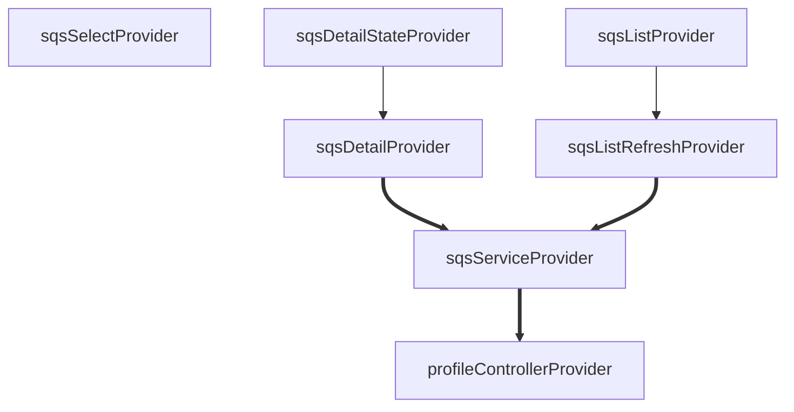
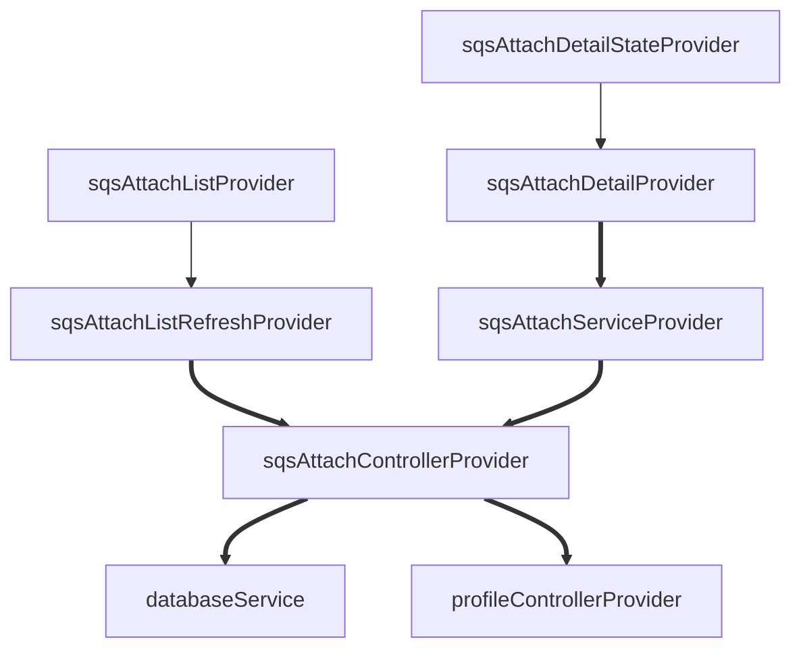

# sqs Common Provider List

## SQS Detail Info Show Purpose

### sqsSelectProvider

> Data storage purpose to know what sqs is currently selected

# sqs Provider List

## Access SQS Purpose

### sqsServiceProvider

> Purpose to import service to use sqs api

- watch: profileControllerProvider
    - purpose: Purpose to read profileController instance initialized with current profile
      information

## SQS Detail Info Show Purpose

### sqsDetailProvider

- watch: sqsServiceProvider
    - purpose: Purpose to read sqs instance initialized with current profile information

### sqsDetailStateProvider

## SQS List Show Purpose

### sqsListRefreshProvider

> sqs list refresh purpose

- watch: sqsServiceProvider
    - purpose: Purpose to read sqs instance initialized with current profile information

### sqsListProvider

> If sqs is being refreshed, separate it into a separate provider to expose the list.

# sqs Provider List For Attachment

## Stored Data Access Purpose

### sqsAttachControllerProvider

Purpose to read information added to db

- watch: databaseService
    - purpose: Purpose of reading data
- watch: profileControllerProvider
    - purpose: The purpose of viewing that information because the sqs added to the profile are
      different

## Access SQS Purpose

### sqsAttachServiceProvider

- watch: sqsAttachControllerProvider
    - purpose: Purpose to read the sqs instance initialized with the profile information set at the
      time of addition

## SQS Detail Info Show Purpose

### sqsAttachDetailProvider

- read: sqsAttachServiceProvider
    - purpose: Used because the information used at the time of addition is required to inquire
      detailed information

### sqsAttachDetailStateProvider

## SQS List Show Purpose

### sqsAttachListRefreshProvider

- watch: sqsAttachControllerProvider
    - purpose: Purpose to read the sqs instance initialized with the profile information set at the
      time of addition

### sqsAttachListProvider